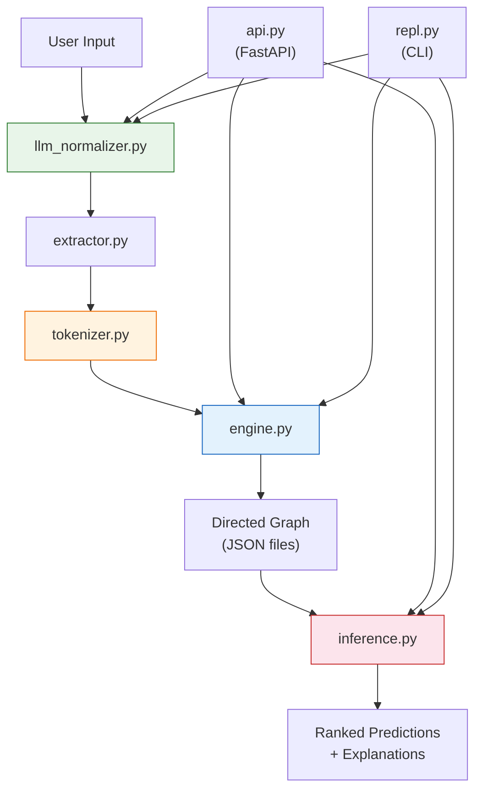

# Architecture

This document provides a detailed look at how the Vela Causal Reasoning Engine works internally.

---

## System Overview

Vela is a **directed causal graph engine** that learns cause → effect relationships from natural language and answers causal queries using beam-search inference.

The core innovation is a **multi-layered de-biasing pipeline** that prevents domain favouritism (e.g. oil/finance domination) by enforcing structured tokens and optionally normalising all input through a local Ollama LLM.

---

## Module Relationships



---

## Data Flow

### Training Pipeline

```
Raw Text
  │
  ├─ (Optional) Ollama LLM Normalizer
  │    ├─ Rewrites into clean causal sentences
  │    ├─ Strips metaphors, ambiguity, domain bias
  │    └─ Returns "NO_CAUSAL_CONTENT" for non-causal input
  │
  ├─ Causal Pair Extractor
  │    ├─ Matches explicit markers: "causes", "leads to", "results in"…
  │    ├─ Splits into (cause_text, effect_text)
  │    └─ Ignores co-occurrence / proximity
  │
  ├─ Structured Tokenizer
  │    ├─ Extracts entity_direction tokens only
  │    ├─ "oil supply decrease" → "oil_supply_decrease"
  │    └─ Bare nouns ("unemployment") → discarded
  │
  └─ Graph Engine
       ├─ Creates directed edge: cause → effect
       ├─ Updates strength (normalised count per cause node)
       ├─ Tracks polarity (reinforcing +1 / conflicting -1)
       └─ Persists to JSON file
```

### Query Pipeline

```
Query Text
  │
  ├─ (Optional) Ollama LLM Normalizer
  │    └─ Cleans query language
  │
  ├─ Structured Tokenizer
  │    └─ Extracts input tokens
  │
  └─ Beam Search Inference
       ├─ Traverses directed graph from input tokens
       ├─ Log-space scoring with depth penalty
       ├─ Direction consistency filtering
       ├─ First-hop boost for direct neighbours
       ├─ Softmax normalisation for probabilities
       └─ Returns ranked predictions with causal paths
```

---

## Component Responsibilities

### `llm_normalizer.py`
- **Purpose**: Anti-bias layer. Rewrites all text into clean, structured causal sentences.
- **Mechanism**: Calls local Ollama `/api/chat` with a strict system prompt and `temperature=0`.
- **Graceful degradation**: Returns raw input unchanged if Ollama is unreachable.
- **Key functions**: `normalize_texts()`, `normalize_query()`, `check_ollama_health()`

### `tokenizer.py`
- **Purpose**: Produces ONLY `entity_direction` structured tokens.
- **Mechanism**: Scans for direction words (`increase`, `decrease`, `rise`, `fall`…) preceded by entity nouns. Rejects bare nouns.
- **Key data**: `CANONICAL` dict maps all verb forms to canonical direction + polarity.
- **Key functions**: `tokenize()`, `tokenize_with_polarity()`, `get_polarity()`

### `extractor.py`
- **Purpose**: Extracts explicit causal pairs from text.
- **Mechanism**: Applies ordered regex patterns for causal markers. No co-occurrence — relationships must be explicitly stated.
- **Key functions**: `extract_causal_pairs()`, `extract_from_texts()`

### `engine.py`
- **Purpose**: Core directed graph store with per-model isolation.
- **Storage**: JSON files in configurable `MODELS_DIR`. Human-readable and debuggable.
- **Edge model**: `cause → {effect: {strength, polarity, count}}`
- **Key functions**: `train()`, `get_graph()`, `get_stats()`, `reset_model()`

### `inference.py`
- **Purpose**: Beam-search traversal of the causal graph with explainability.
- **Scoring**: Log-space to prevent underflow, depth penalty, first-hop boost, polarity alignment.
- **Explainability**: BFS-based `explain_path()` returns shortest causal chain with plain-English description.
- **Key functions**: `infer()`, `query()`, `explain_path()`

### `api.py`
- **Purpose**: FastAPI REST backend.
- **Endpoints**: `/train`, `/query`, `/explain`, `/health`, `/models`, `/reset`
- **CORS**: Enabled for all origins (tighten in production).

### `repl.py`
- **Purpose**: Interactive CLI for training, querying, and exploring models.
- **Commands**: `train:`, `query:`, `explain:`, `graph`, `stats`, `models`, `switch:`, `reset`, `llm on/off`

---

## Edge Strength Normalisation

Edge strengths are normalised per cause node to produce probability-like values:

```
strength(cause → effect) = count(cause → effect) / total_count(cause → all_effects)
```

This means strengths across different cause nodes are not directly comparable, but within a single cause node they represent relative likelihood.

---

## Inference Scoring

The beam-search scoring formula per hop:

```
score = prev_score + log(edge_strength + 1e-9) - (0.25 × depth)
```

Additional modifiers:
- **First-hop boost**: `+0.6` for depth=0 (direct neighbours rank higher)
- **Polarity alignment**: `+0.2` if prediction direction matches input direction, `-0.4` if opposing
- **Direction consistency**: Predictions that would require illogical polarity jumps are filtered out entirely

Final scores are converted to probabilities via softmax.

---

## Persistence Format

Each model is stored as a single JSON file in `models/`:

```json
{
  "model_id": "my_model",
  "description": "Supply chain disruption model",
  "doc_count": 42,
  "word_freq": {
    "oil_supply_decrease": 5,
    "price_increase": 3
  },
  "edges": {
    "oil_supply_decrease": {
      "price_increase": {
        "strength": 1.0,
        "polarity": -1,
        "count": 5
      }
    }
  }
}
```

This format is intentionally human-readable for debugging and inspection.
